# Élan Atelier

<!-- SCREENSHOT 01: Main repository cover -->
<p align="center">
  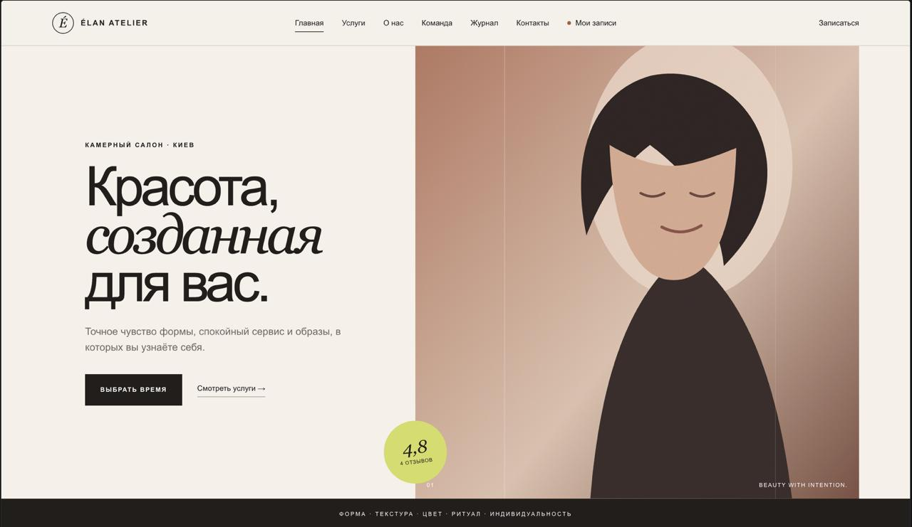
</p>

<p align="center">
  <strong>Editorial beauty studio website and full-featured online booking platform.</strong>
</p>

<p align="center">
  <a href="https://github.com/webnix-technologygroup/elan-atelier/actions/workflows/tests.yml">
    
  </a>
  
  
  
</p>

## Overview

**Élan Atelier** is a portfolio-ready Django application that combines an editorial beauty studio website with a production-oriented booking platform.

The project includes a six-step booking wizard, server-side availability calculation, passwordless customer authentication, a protected customer cabinet, calendar exports, cancellations, rescheduling requests, notification logs and a comprehensive Django Admin interface.

> This is a demonstration portfolio project. Names, contacts, addresses and booking records included in the seed data are fictional.

## Key features

### Public website

- Editorial responsive design
- Services and service detail pages
- Team profiles
- Filterable gallery
- Journal and article pages
- Reviews and accessible FAQ
- Contacts and privacy pages
- SEO metadata, sitemap, robots.txt and JSON-LD
- Custom 404 and 500 pages

### Online booking

- Six-step booking wizard
- Service and master selection
- “Any available master” option
- Server-calculated available slots
- Working schedules, breaks, time off and booking buffers
- Client-side and server-side validation
- Accessible errors and focus management
- Final review before confirmation

### Customer cabinet

- Magic-link authentication
- One-time login codes
- Protected booking ownership
- Upcoming appointments and booking history
- Cancellation with slot release
- Rescheduling requests
- Standards-compliant `.ics` calendar export

### Management

- Django Admin
- Services, team and schedules
- Time off and special working days
- Customers and bookings
- Rescheduling approval and rejection
- Journal, FAQ, gallery and reviews
- Notification logs
- Idempotent demonstration seed

## Interface

<!-- SCREENSHOTS 02–04: Public website gallery -->
<table>
  <tr>
    <td width="50%">
      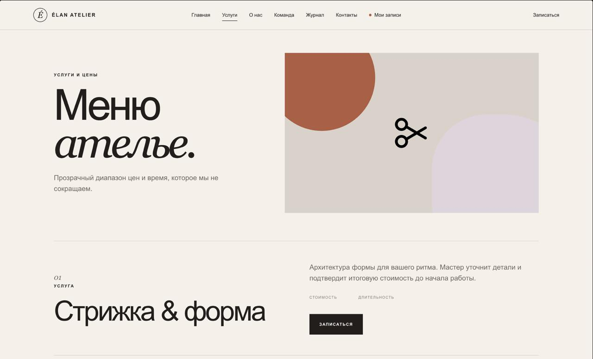
      <br><strong>Services catalogue</strong>
    </td>
    <td width="50%">
      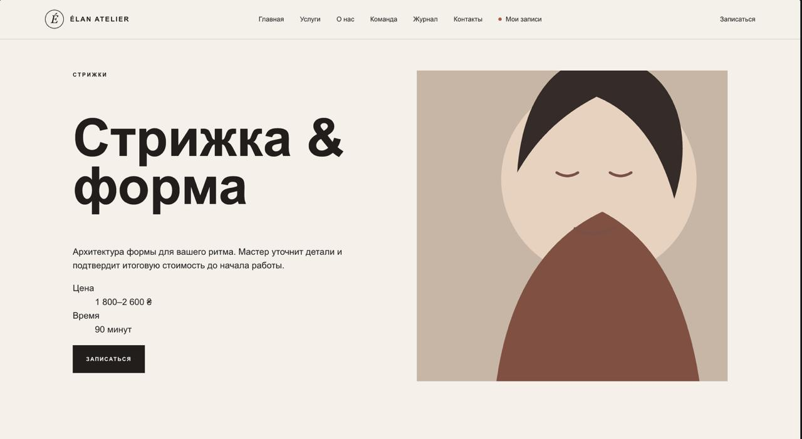
      <br><strong>Service details</strong>
    </td>
  </tr>
  <tr>
    <td colspan="2">
      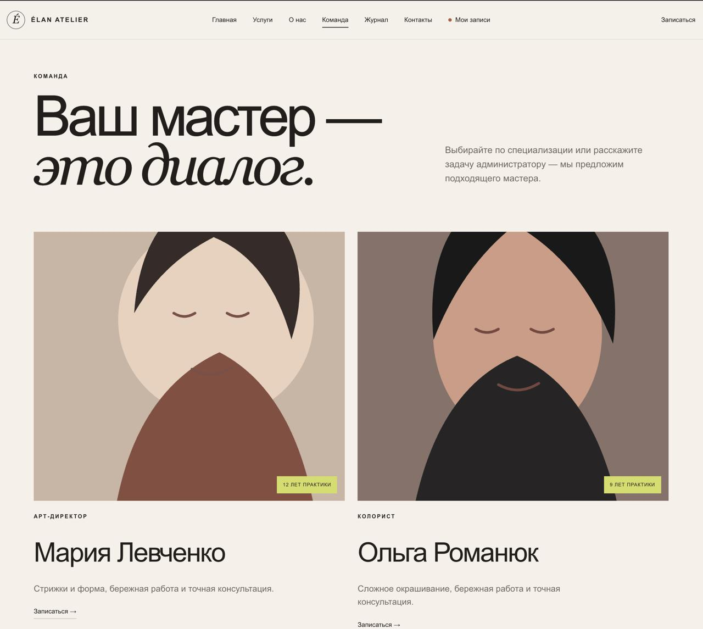
      <br><strong>Gallery</strong>
    </td>
  </tr>
</table>

## Booking flow

The booking interface guides a customer through service, master, date, time and contact selection before displaying the final confirmation screen.

<!-- SCREENSHOTS 05–10: Booking wizard -->
<table>
  <tr>
    <td width="50%">
      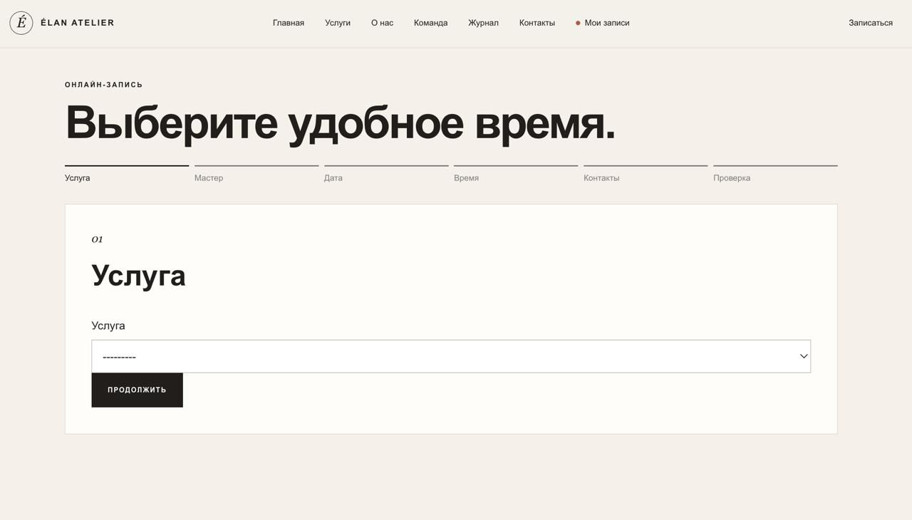
      <br><strong>1. Service selection</strong>
    </td>
    <td width="50%">
      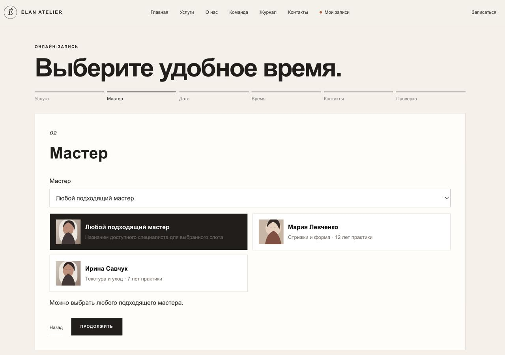
      <br><strong>2. Master selection</strong>
    </td>
  </tr>
  <tr>
    <td width="50%">
      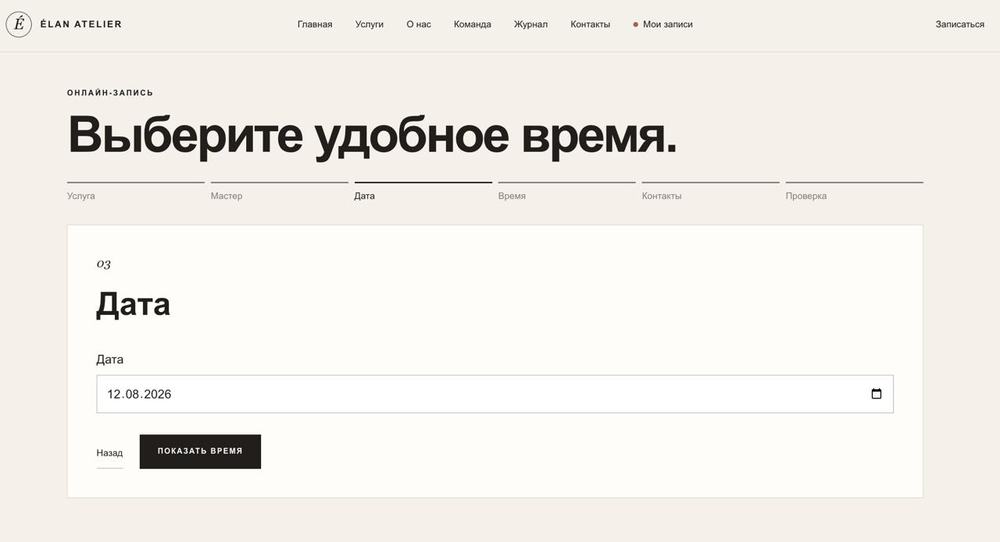
      <br><strong>3. Date selection</strong>
    </td>
    <td width="50%">
      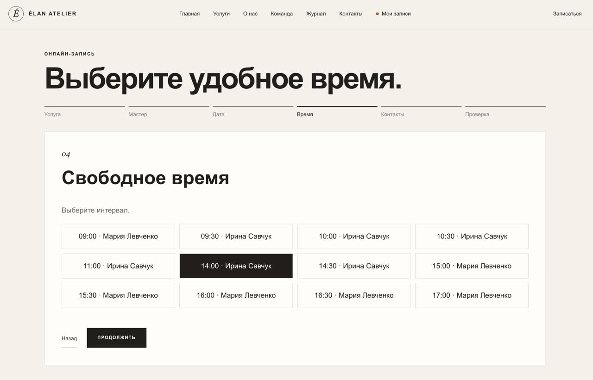
      <br><strong>4. Available time</strong>
    </td>
  </tr>
  <tr>
    <td width="50%">
      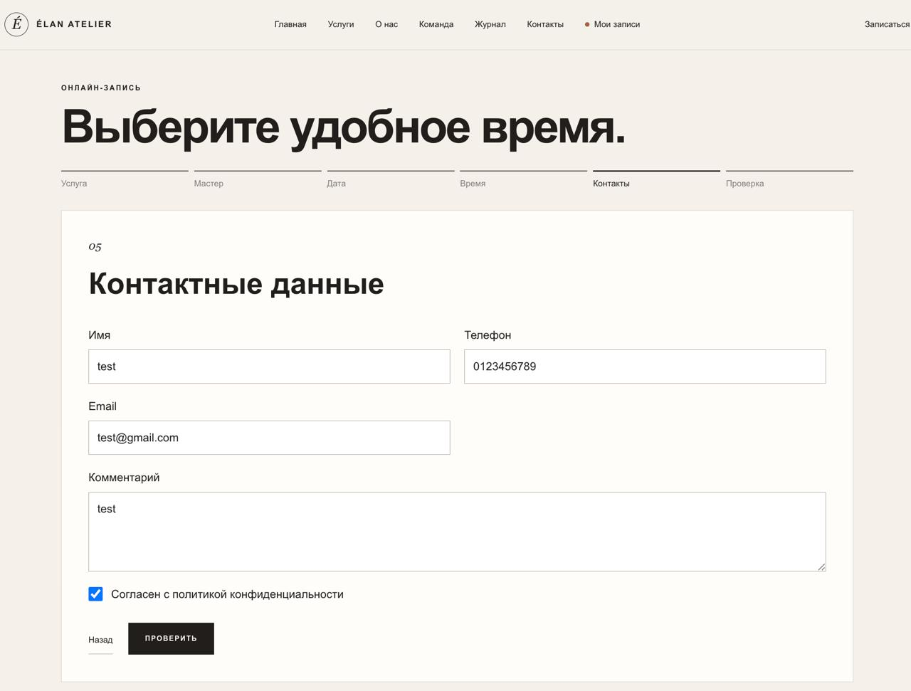
      <br><strong>5. Contact details</strong>
    </td>
    <td width="50%">
      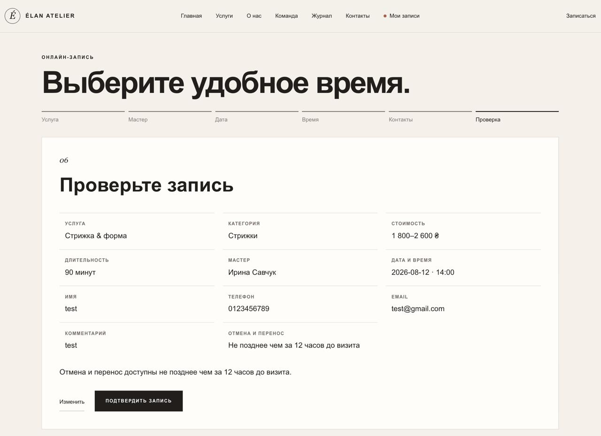
      <br><strong>6. Booking review</strong>
    </td>
  </tr>
</table>

## Customer experience and management

<!-- SCREENSHOTS 11–14: Success, cabinet, booking details and Admin -->
<table>
  <tr>
    <td width="50%">
      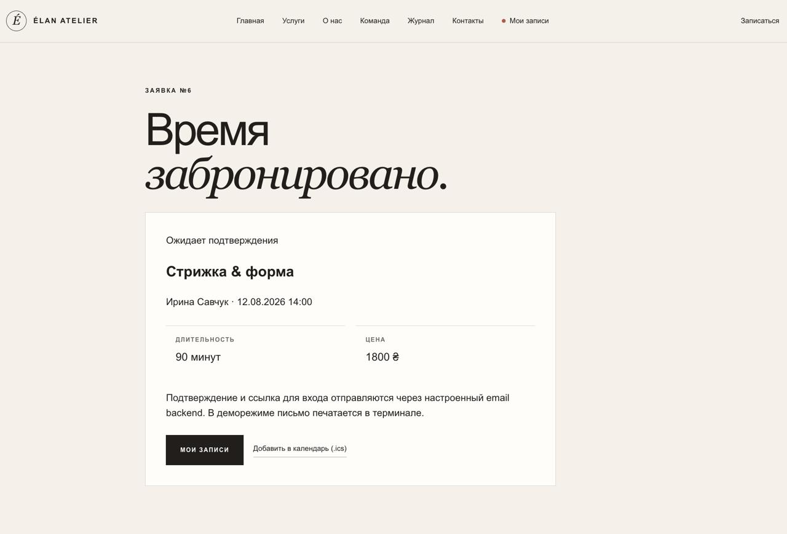
      <br><strong>Booking confirmation</strong>
    </td>
    <td width="50%">
      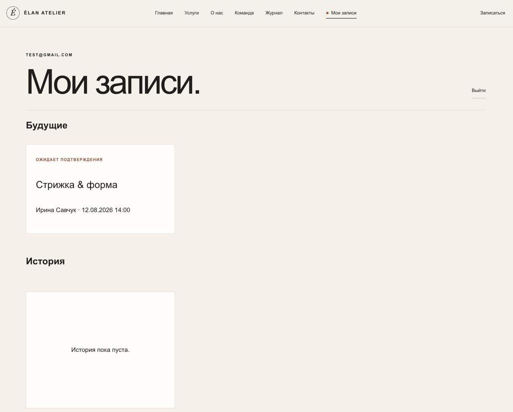
      <br><strong>Customer cabinet</strong>
    </td>
  </tr>
  <tr>
    <td width="50%">
      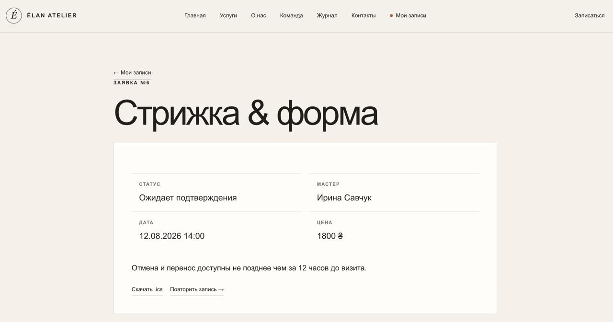
      <br><strong>Booking details</strong>
    </td>
    <td width="50%">
      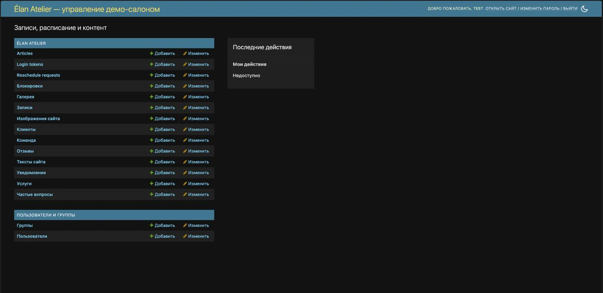
      <br><strong>Django Admin</strong>
    </td>
  </tr>
</table>

## Responsive design

The public website, booking wizard and customer cabinet are adapted for desktop, tablet and mobile screens.

<!-- SCREENSHOTS 15–16: Mobile presentation -->
<table>
  <tr>
    <td width="50%" align="center">
      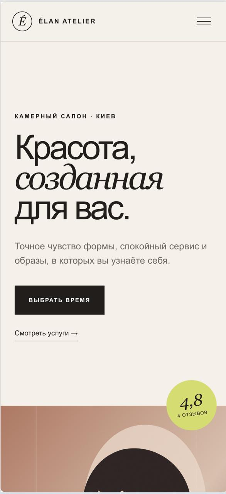
      <br><strong>Mobile home</strong>
    </td>
    <td width="50%" align="center">
      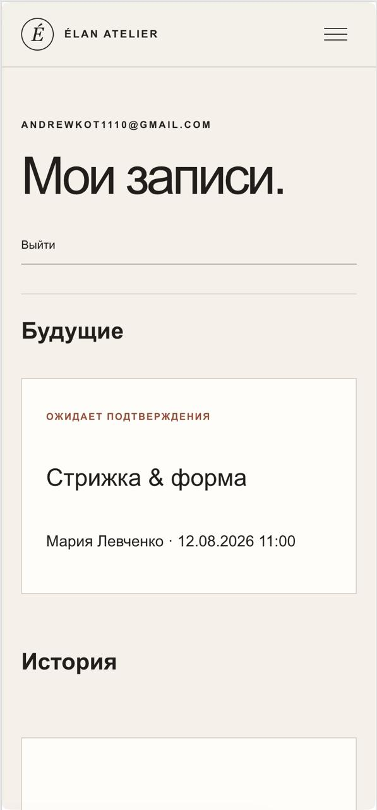
      <br><strong>Mobile booking</strong>
    </td>
  </tr>
</table>

## Technology stack

- Python 3.12+
- Django 5.2
- SQLite for local development
- PostgreSQL-ready production configuration
- Vanilla JavaScript
- Semantic HTML and custom CSS
- WhiteNoise
- Pillow
- Black and Ruff
- GitHub Actions
- Docker-ready deployment

## Local setup

### 1. Clone the repository

```bash
git clone https://github.com/webnix-technologygroup/elan-atelier.git
cd elan-atelier
```

### 2. Create a virtual environment

Windows PowerShell:

```powershell
py -3.12 -m venv .venv
Set-ExecutionPolicy -Scope Process -ExecutionPolicy Bypass
.\.venv\Scripts\Activate.ps1
```

macOS or Linux:

```bash
python3 -m venv .venv
source .venv/bin/activate
```

### 3. Install dependencies

```bash
python -m pip install --upgrade pip
python -m pip install -r requirements.txt
```

For development checks:

```bash
python -m pip install -r requirements-dev.txt
```

### 4. Prepare the database

```bash
python manage.py migrate --noinput
python manage.py seed_demo --clear
```

### 5. Create an administrator

```bash
python manage.py createsuperuser
```

### 6. Start the development server

```bash
python manage.py runserver
```

Open:

- Website: `http://127.0.0.1:8000/`
- Admin: `http://127.0.0.1:8000/admin/`

Development email is printed directly to the terminal through Django’s console email backend.

## Quality checks

```bash
black --check config studio manage.py
ruff check config studio manage.py
python -m compileall -q config studio manage.py
python manage.py makemigrations --check
python manage.py check
python manage.py test -v 2
python manage.py collectstatic --noinput
```

JavaScript syntax:

```bash
node --check studio/static/studio/js/main.js
node --check studio/static/studio/js/booking.js
node --check studio/static/studio/js/reschedule.js
```

The test suite currently contains **41 automated tests** covering booking availability, ownership protection, authentication, cancellation, rescheduling, notifications, calendar export and seed idempotency.

## Production configuration

Copy `.env.example` to `.env` only for local configuration. Never commit `.env` or production secrets.

Important environment variables:

```text
DJANGO_DEBUG=0
DJANGO_SECRET_KEY=<strong-random-secret>
DJANGO_ALLOWED_HOSTS=<domain>
DJANGO_CSRF_TRUSTED_ORIGINS=https://<domain>
DB_ENGINE=django.db.backends.postgresql
DB_NAME=<database-name>
DB_USER=<database-user>
DB_PASSWORD=<database-password>
DB_HOST=<database-host>
DB_PORT=5432
```

Production static files use WhiteNoise with `CompressedManifestStaticFilesStorage`. Development uses Django’s regular `StaticFilesStorage`.

Before deployment:

```bash
python manage.py collectstatic --noinput
python manage.py check --deploy
```

## Security notes

- Booking success and `.ics` downloads require an authenticated customer session.
- A booking is returned only when its `customer_id` matches the session customer.
- Customerless and foreign bookings are not disclosed.
- Magic links are single-use and time-limited.
- Login codes are hashed and protected by an attempt limit.
- Production mode rejects the development secret key.
- Secure cookies, HTTPS redirect and HSTS are enabled outside development.
- Secrets, local databases, virtual environments and generated static files are excluded from Git.

## Project documentation

- [Case study](CASE_STUDY.md)
- [Audit report](AUDIT_REPORT.md)
- [Manual verification steps](MANUAL_STEPS.md)
- [Portfolio readiness checklist](PORTFOLIO_CHECKLIST.md)

## Repository structure

```text
config/                  Django settings and root URLs
studio/                  Application code
studio/services/         Booking, availability, authentication and notifications
studio/templates/        Public website, cabinet and error templates
studio/static/           Source CSS, JavaScript and images
studio/migrations/       Database schema and data migrations
docs/screenshots/        Portfolio screenshots
.github/workflows/       Continuous integration
```

## Project status

The application has completed local automated and browser checks as a portfolio case. External deployment, production SMTP, Telegram delivery and infrastructure-specific PostgreSQL verification depend on the selected hosting environment.

---

<p align="center">
  Built as a portfolio case by <strong>Webnix Technology Group</strong>.
</p>
